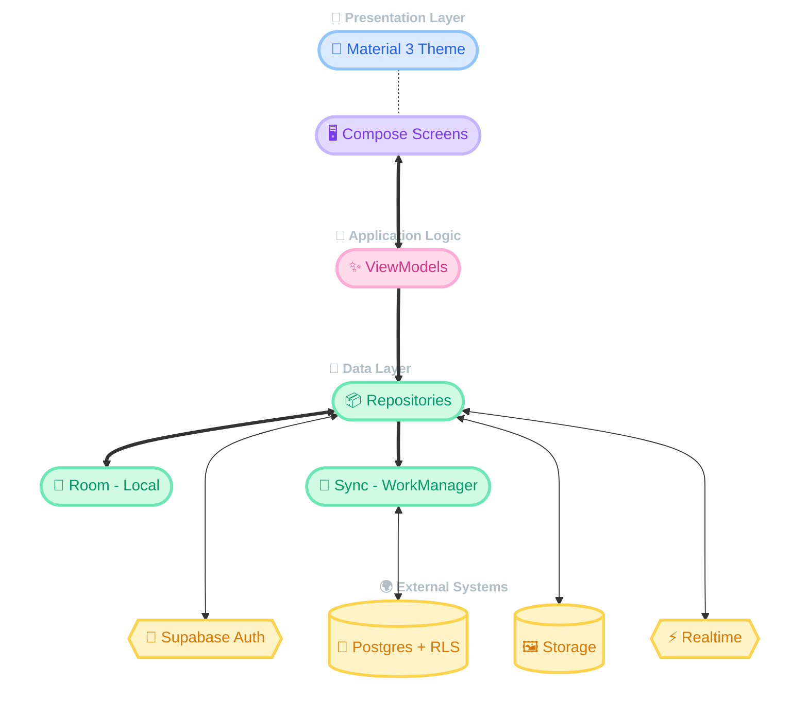

[](https://kotlinlang.org/)
[](https://developer.android.com/jetpack/compose)
[](https://developer.android.com/)
[](https://supabase.com/)

*A modern, local-first food diary, spending tracker, and social app for Android, built with Jetpack Compose and Supabase* 🍜

[Key Features](#-key-features) • [Tech Stack](#-tech-stack) • [Installation](#-installation--usage) • [Team](#-team-members)

## 📖 Project Overview

Food Tracker is a mobile application that helps users log their meals, track personal spending, and share their food journey with friends. Unlike a plain expense app, Food Tracker combines a visual meal diary, smart spending analytics, a social newsfeed, real-time messaging, and shared group wallets in one place. It is built **local-first**: every action is saved to the device instantly for a smooth, offline-friendly experience, then synced to the cloud automatically when a connection is available. This application is developed by students at UIT (University of Information Technology, Vietnam National University - Ho Chi Minh City).

## 🛑 Disclaimer

**IMPORTANT NOTICE**: This application is a student project developed for educational and portfolio purposes.

- The project is **Open Source**.
- It leverages free services (Supabase free tier, a free exchange-rate API) and is configured for development/test use.
- It was created solely for academic purposes and is not intended for commercial distribution.
- The app is not officially supported and may contain unaddressed issues. Not intended for production use.

## 📚 Academic Project

This project was developed as part of a course requirement at UIT.

### Academic Context

- **Course:** SE114 — Introduction to Mobile Application Development
- **Objective:** Demonstrate proficiency in **Android application development** using **Kotlin, Jetpack Compose, and a cloud backend (Supabase)**.

### Academic Integrity

- This project is for educational purposes.
- Not intended for commercial distribution.
- Developed as a practical application of **MVVM architecture**, **local-first synchronization**, **cloud integration**, and **modern declarative UI design**.

## ✨ Key Features

- 📔 **Meal Diary** — Log meals by day and time of day with photos, price, rating, and notes on a clean monthly calendar.
- 📊 **Spending Analytics** — Track spending by day/week/month/year with charts, budgets, forecasts, and period comparisons.
- 👥 **Friends & Social Feed** — Add friends by user ID, post your meals to a photo grid, and react with likes and comments.
- 💬 **Real-time Messaging** — One-to-one and group chats with instant delivery and an offline message queue.
- 💰 **Group Wallets** — Shared funds inside group chats: deposit, withdraw, and spend together with a full transaction history.
- 🔄 **Local-first Sync** — Everything works offline and syncs to Supabase automatically when you reconnect.
- 🌗 **Multi-currency** — Enter prices in any of 6 currencies; values are preserved and converted at display time using live rates.
- 🛡️ **Admin Tools** — A separate, role-gated admin area for moderating users and reports, secured at the backend.

## 📱 Screenshots

<!-- Replace these with your real screenshots in docs/assets/ -->
<p align="center">
  
  
  
  
</p>

**Interface Preview:** Meal Diary • Spending Statistics • Newsfeed • Chat • Setting

## 🛠 Tech Stack

### Core Technologies

[](https://kotlinlang.org/)
[](https://developer.android.com/jetpack/compose)
[](https://m3.material.io/)

### Backend & Cloud

[](https://supabase.com/)
[](https://www.postgresql.org/)

### Architecture & Libraries

[](https://dagger.dev/hilt/)
[](https://developer.android.com/training/data-storage/room)
[](https://kotlinlang.org/docs/coroutines-overview.html)

### Development Tools

[](https://developer.android.com/studio)
[](https://git-scm.com/)

## 🔌 Key Integrations & Libraries

### Local-first Persistence & Sync

Food Tracker uses **Room** as the on-device source of truth and **WorkManager** to sync changes to **Supabase** in the background. Every write lands in Room first (so the UI is instant) and is pushed to the cloud when connectivity allows, with last-write-wins conflict resolution.

### Supabase Backend

**Supabase** provides authentication (email/password + Google), a PostgreSQL database with row-level security and stored procedures, file storage for images, and realtime channels that power instant chat and live conversation updates.

### Declarative UI with Jetpack Compose

The entire interface is built with **Jetpack Compose + Material 3**, giving a consistent, modern, and responsive design across the whole app without legacy XML layouts.

## 🎯 Project Architecture



## 👥 Team Members

<!-- Fill in real names, GitHub handles, and student IDs -->

| Role | Name | GitHub | Student ID |
| ---- | ---- | ------ | ---------- |
| **🛠️ Project Leader & Auth / Sync / Admin** | **Tịnh Văn** | [Tinh Van](https://github.com/vanilalaaa) | 24521978 |
| **⚙️ Database & Diary / Statistics** | **Ánh Vân** | [Azun](https://github.com/anhvansan) | 24521978 |
| **🎨 UI/UX & Friends / Newsfeed** | **Thúy Vy** | [ThuyVy](https://github.com/NguyenPhamThuyVy) | 24521978 |
| **💬 UI & Chat / Group Wallet / Report** | **Thảo Uyên** | [ThaoUyen](https://github.com/NguyenPhamThuyVy) | 24521978 |

## 📦 Installation & Usage

### Option 1: Download & Run (For Users)

No coding skills required! Just download and install.

1. Go to the **[Releases](https://github.com/vanilalaaa/SE114-Food-Tracker/releases)** page of this repository.
2. Download the latest `FoodTracker_v1.0.0.apk` file.
3. Copy it to your Android phone and open it.
4. If prompted, allow **"Install from unknown sources"**, then tap **Install**.

> **Note:** Requires Android 7.0 (API 24) or newer. Google sign-in requires Google Play Services on the device.

### Option 2: Build from Source (For Developers)

If you want to modify the code or contribute to the project.

#### Requirements

- Android Studio (Iguana or newer).
- JDK 17.
- Android SDK (API 24–35).
- Git.
- A Supabase project (URL + anon key).

#### Steps

1. **Clone the Repository**

```bash
git clone https://github.com/vanilalaaa/SE114-Food-Tracker.git
cd SE114-Food-Tracker
```

2. **Configure Supabase keys**

Create or edit `local.properties` in the project root and add:

```properties
SUPABASE_URL=https://your-project.supabase.co
SUPABASE_ANON_KEY=your-anon-key
GOOGLE_WEB_CLIENT_ID=your-google-web-client-id
```

> `local.properties` is gitignored — never commit your keys.

3. **Apply the database migrations**

In the Supabase Dashboard → SQL Editor, run the files under `supabase/migrations/` in order.

4. **Open in Android Studio**

- Open the project and wait for Gradle Sync to finish.

5. **Restore & Run**

- Select a device or emulator (with Google Play Services for Google sign-in).
- Press **Run** (▶) or execute `./gradlew assembleDebug`.

## 📚 Learning Outcomes

This project provided valuable experience in:

- **MVVM Architecture:** Clean separation between UI, logic, and data layers.
- **Jetpack Compose:** Building complex, responsive, declarative Android UIs.
- **Local-first Sync:** Offline-first data with background synchronization and conflict resolution.
- **Cloud Integration:** Authentication, row-level security, storage, and realtime with Supabase.
- **Asynchronous Programming:** Coroutines and Flow for smooth, reactive UIs.

## 📞 Contact

For academic inquiries or project details, please contact:

<!-- Fill in real contacts -->
- **Huỳnh Tịnh Văn:** <htvan.se@gmail.com>
- **Trần Phương Ánh Vân:** <anhvantran.0910@gmail.com>
- **Hoàng Thị Thảo Uyên:** <ht.thaouyen1203@gmail.com>
- **Nguyễn Phạm Thúy Vy:** <vyvy@gmail.com>

---

<p align="center">Made with ❤️ by UIT Students • Contact us for collaboration! ✨</p>

<p align="center">© 2026 Food Tracker Project</p>
